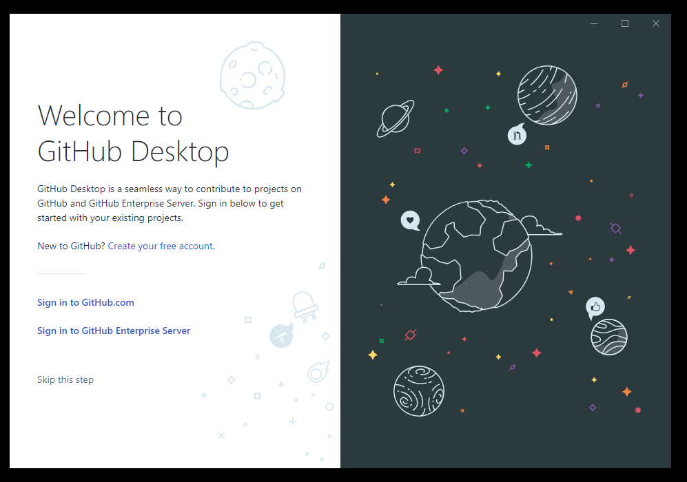
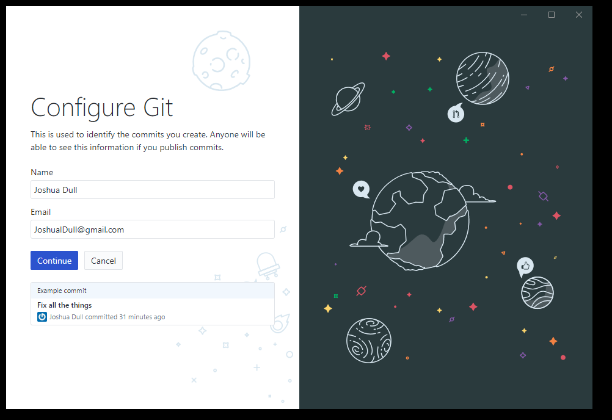
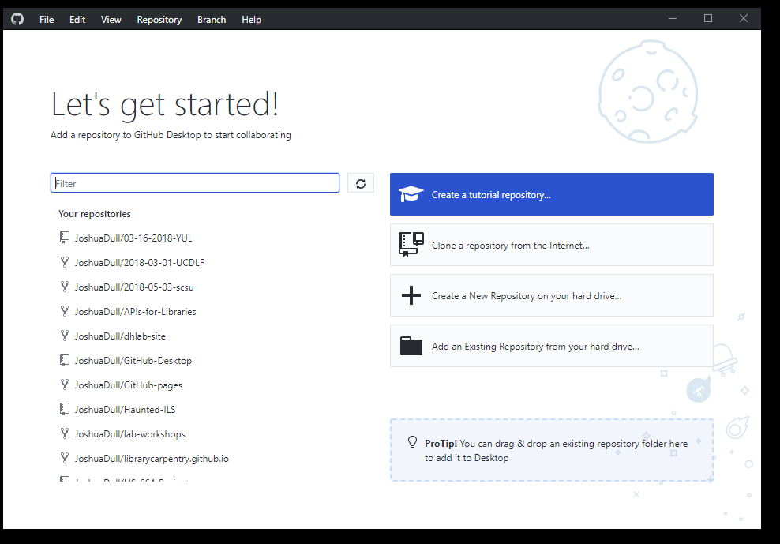
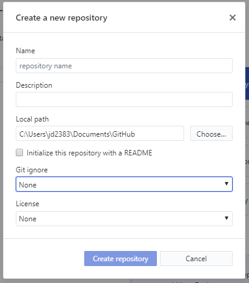
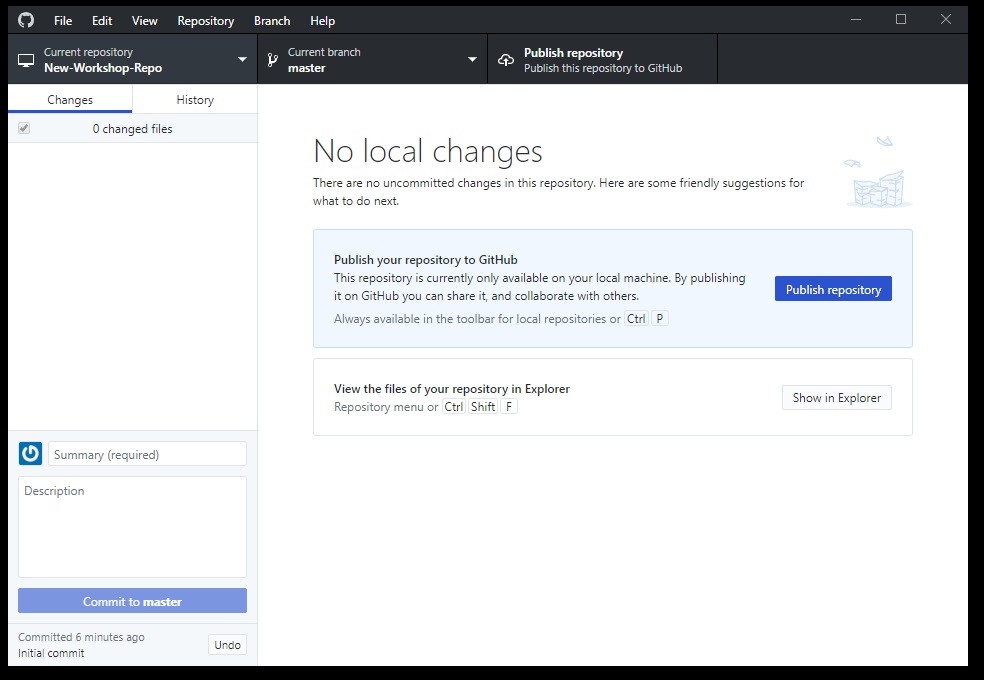
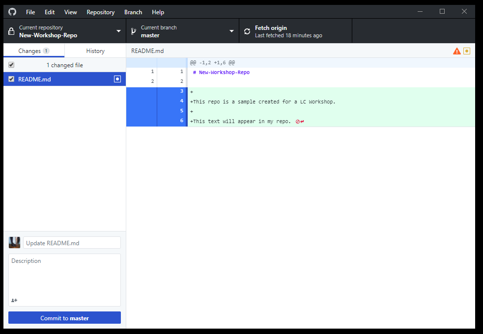

### Using GitHub Desktop

One of the main barriers to getting started with git is the language. Although some of the language used in git is 
fairly self-explanatory, other terms are not so clear. The best way to get to learn the language - which consists of a 
number of verbs such as `fetch`, `commit` and `push` - is by using it, which is what we will be doing during this 
lesson. These commands will be explained as we proceed from setting up a new version-controlled project to publishing our own website.

### GitHub Desktop Set-up

Before we can start tracking version, we must set-up our GitHub Desktop application with our GitHub account information. 

> ## Connecting to your GitHub account
> We will connect to our GitHub account using our username and password (if you didn't create a GitHub account before the lesson, you will need to do so now before you can proceed). 
>1. Open GitHub Desktop. Click 'Sign in to GitHub.com'
>  
>2. Sign in using your GitHub username & password.
>3. Update your user information if necessary.
>  
>4. Click 'Finish'.
>
{: .checklist}

You should now be logged in to your GitHub account. If you have any repositories associated with your account, you should see them listed in the left panel. 

### Creating a local repository

Now we are ready to create our first repository. Select 'Create a New Repository on your hard drive'.

Now we need to fill out some basic information about our repository before we can proceed.

* **Name** - The repository name. This will appear as the URL for the repo (it is best to not use spaces in the name).
* **Description** - Describe the contents of your repository.
* **Local path** - Destination on your machine to store the repository files. This will create a direcotry with the repository name. 
* **README** - Do you want to create a default README file for the repo? A README contains basic info about your repository and how to use the code or data you've uploaded.
* **Git ignore** - Choose default files to ignore. You can edit this file later.
* **License** - Choose to assign a license to your repository.

> ## Choosing a license
> Choosing a license is an important part of openly sharing your creative work online. For help in wading through the
> many types of open source licenses, please visit <https://choosealicense.com/>.
{: .callout}

Click 'Create Repository'. Now we've created our first local Git repository. 

### Publishing to GitHub

If we go the the directory we set as the 'local path' above, we should see a directory with our repo name. In this directory, we should see several files that we just created (README, .gitignore, license). 

In order to make our repo public, we need to click 'Publish repository'. This will publish our repo to GitHub.com and it will be listed under our list of repositories. 

### Making changes to a repository

The power of Git & GitHub are tracking local changes in files over time, then sharing those changes on GitHub. This is the basis of version control. 

> ## The README file
> It is good practice to add a README file to each project to give a brief overview of what the project is about. If you 
> put your README file in your repository's root directory, GitHub will recognize and automatically surface your README 
> to repository visitors.
{: .callout}

Let's edit our README file by adding some useful information about this repository. 

> ## Edit the README
> The README file is written in markdown. Markdown is a simple way to style text on  the web. We'll talk more about markdown in episode 5. 
>1. Navigate to the repository directory & open the README file using a text editor.
>2. Add a few lines to the README describing this repository. Include any documentation or metadata necessary to understand the files in this repo.
>3. Save and close the README file.
>
{: .checklist}

### Commit & push changes to GitHub

We've made changes to the files in our repo. To track these changes as a new version, we need to goto the GitHub Desktop application and 'commit' our changes. We can then 'push' our version to the GitHub repo so our changes are reflected in the public repository.

GitHub Desktop will display the differnces between each file we've updated or added to the repo. If it is a text file, you'll see the line-by-line changes to the file. While Git can track changes for files like images, the differences will not be compareable in the Desktop application. 

> ## Commit and push changes to GitHub
> Now we can commit a new version of the repo and push our changes to GitHub so our collaborators can see the latest version.
>1. Check the difference between the versions.
>2. Write a descriptive commit message (See callout below for more on commit messages).
>3. Push the changes to GitHub by click 'Push'.
>4. Check your GitHub account to verify the commit was pushed to your public repo.
>
{: .checklist}

> ## Commit messages
>Commit messages are required for each version of a repo. It is best practice for a commit meesage to be a short, but descriptive summary of the major changes to this verison. 
>**Think of a commit message as the human readable identifier for each version.** View the [wiki](https://wiki.openstack.org/wiki/GitCommitMessages#Information_in_commit_messages) for more information on commit message best practices.
>
{: .callout}

### Adding files to a repo

We can also add new files to our repo and have Git begin tracking the changes. Any file or direcotry we add to our main (root) directory will be automatically tracked by Git. If we don't want a file tracked, we should add it to the `.gitignore` file.

>## Create & add new files
> Let's create new file in out repo and add an existing file. Git can track all types of files, not just text based. 
>1. Open your text editor and create a new file.
>2. Write some lines of text (it doesn't metter what).
>3. Save & close the file (make sure to save the file inside our repo directory).
>4. Add an image file to your repo directory. If you don't have any images on your machine: 
> - Open a web browser and Google search "dog"
> - Right-click the image and select 'Save Image As...'
> - Save the image inside your repo directory.
>5. Commit your new changes and push those changes to GitHub.
>
{: .checklist}

### Edit & Commit on GitHub.com

You can also edit files and commit changes using the GitHub.com site. You can only edit repos that you own or have been given edit permissions to. 

>## Working on GitHub.com
>Let's edit our README file directly fromthe GitHub.com site. Make sure you are logged in to your account.
>1. Go to GitHub.com and find the repo we created for this workshop.
>2. Click on the README.md file. This will take you to another page.
>3. Click on the pencil icon for 'Edit'.
>4. Add a new line to this file.
>5. Create a commit message and click 'Commit changes'.
>
{: .checklist}

After editing files on GitHub.com, we can 'fetch' changes to the repo made through GitHub.com using GitHub Desktop. This will sync our local repository to match the version on GitHub.com. 

Before proceeding to the next episode, be sure to open GitHub Desktop, select your repo, and click 'fetch'. Now your local files should match any edits you made using GitHub.com.