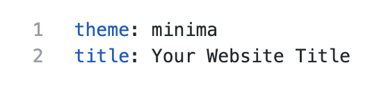
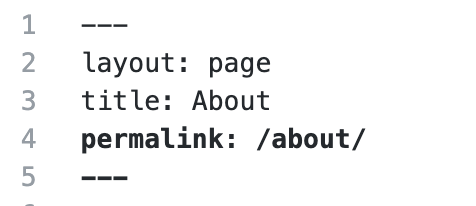

## GitHub Pages

GitHub Pages is a simple service to publish a website directly on GitHub from a Git repository.
You add some files and folders to a repository and GitHub Pages turns it into a website.
You can use HTML directly if you like, but they also provide Jekyll,
which renders Markdown into HTML and makes it really easy to setup a blog or a template-based website.

### Why GitHub Pages is awesome!

GitHub Pages allows you to version control your website. This is useful for a lot of different reasons. It allows you to 
keep a record of what changes you have made. It allows people to reference your website at a particular point in time 
and (if you make your source open) to see what it was like at that particular point in time. This is very useful for 
academic citations. Most people have had the experience of following up a reference to a website and either getting a 
404 error or seeing something completely different. Although using versions on your site doesn't guarantee this won't 
happen, it does make it easier to manage old versions of your site.

GitHub Pages also mean that you can collaborate on a website with a lot of people without everyone having to 
communicate endlessly back and forwards about what changes need to be made, or have been made already. You can create 
'issues' (things that need discussing or fixing), list things to do in the future, and allow other people visiting your 
website to quickly suggest, and help implement changes through pull requests.

### Setting up a site

Now we're all persuaded of how awesome GitHub Pages is (or you've identified some fatal flaws in my reasoning), it 
would be useful to try playing around with some things we can do with it. This will help us cement what we 
have learned in the previous hour and may help spark discussion for the last section of this session.

There are various options for setting up a GitHub Pages site. Let's run through a few of them now.

> ## Create index.md
>
> 1. In your text editor, create a new text file.
> 2. Add some text. 
> 3. Save the file to your local repository. Make sure the file is named 'index.md'.
> 4. Using GitHub Desktop, make a new commit and push your changes to GitHub (our remote repository). 
>
{: .checklist}

### View your site

Visit **`https://github-username.github.io`**.
We should see the contents of the index.md file that created earlier.
Usually updates are available quickly, but it can take a few seconds and in the worst case a few minutes depending on how many changes you make. **If you don't see your changes, try refreshing the page.**

### Adding content with mardkdown

Markdown is a simple syntax for editing web pages. It's limited in what it can do, but is easy to learn. 
- [Mastering Markdown](https://guides.github.com/features/mastering-markdown/) is a helpful tutorial for leanring the functions of markdown using GitHub Pages.
- [Markdown Live Preview](https://markdownlivepreview.com/) let's your edit and preview markdown so you can see how the syntax changes the style.

> ## Challenge: Working with Markdown
> 1. Use the [Markdown Cheatsheet](https://github.com/adam-p/markdown-here/wiki/Markdown-Cheatsheet) to add more styled text to your home-page (index.md):
> - Add a list.
> - Add a link to `google.com`.
> 2. Add an image to your site. You can use an image online or upload an image to your repository.
> - Online Image: Find an image online, right-click on the image, and choose 'copy link address'. Paste this image link into the (parentheses).
> - Local Image: Move an image into you local repo. Add '../image_name.png' to the parentheses (replace 'image_name' with the actual file name).
> 3. Commit and push your changes to GitHub. View your site and see if it looks how you expected.
> 4. If you have time, add more content to your site and practice more markdown.
>
{: .challenge}

### Using GitHub Pages themes

GitHub provide some free themes we can apply to our site to add a more professional style. GitHub pages uses [Jekyll](https://jekyllrb.com/) to create themes and apply them to your site. This adds more options for development, but users can still rely on the simplicity of Markdown for most of thier edits.

> ## Applying a Jekyll theme
> * Choose 'Create a new file'.
> * Name the file `_config.yml`. 
> * Add the folowing text to the file:
> 
> * Once we commit this config file, GitHub pages applies the theme to our site. This will give us new options on the layout of our site.
> 
> * Click on `'index.md'` and choose to edit the file (clicking on the pencil).
> * Add the following text to the top of the file. This text tells GiHub to treat this as our home page. 
> 
>
{: .checklist}

### Creating a new page

Currently we have a site with one page, let's create a new 'About' page for our site.

> ## Adding a page to a site
> 1. In your repo on GitHub.com, select 'Create a new file'.
> 2. Name the file 'about.md'.
> 3. Add the following config metadata to the top of your file
> 
> 4. Below this, add a some text describing yourself. You can add as much as you like (this is your site now!).
> 5. Commit this file.
> - Add a commit message.
> - Make sure the option 'Commit directly to the master branch' is selected.
> - Press 'Commit new file'.
> 
{: .checklist}

Visit your page again. You should see an 'About' page in your home menu now. Click on the link to see the page we just created. The URL should be `https://github-username.github.io/about/`. 

> ## Challenge: Create a new page
> Now that you know how to add a page to your site, you can add as many pages as you want with the same steps. 
>
> 1. Create a new page of your choice.
> 2. Add some content to this page.
> 3. Commit this new file and view your updated website.
>
{: .challenge}

### Fetch changes locally

We've made a lot of edit to our site directly on GitHub.com. We can also edit our site locally using a text editor. To do this we need to make sure our local repo is in-sync with our remote repo.

In GitHub Desktop, select the repo with your website and select the 'gh-pages' branch. Now press 'Fetch origin', this will fetch all the changes we've made to our site and update our local files (adding the new files we cretead as well). 

If we edit these files on our local machine, commit, and push them to GitHub, our site will be updated. It can take several minutes for these updates to be refelected online. 

> ## Optional challenge: Adding an HTML page
>
> GitHub Pages is not limited to Markdown. If you know some HTML, try adding an HTML page
> to your repository. You could do this on the command line or directly on GitHub. The
> steps below are for working directly on GitHub:
>
> 1. To add a new file directly on GitHub, press the "Create new file" button. 
>
>    
>
> 2. Name it 'test.html', add some HTML and click "Commit new file".
> 3. Try opening `https://github-username.github.io/text`
>    (replace "github-username" with your username).
>    Notice that the HTML extension is not included.
>
{: .challenge}
